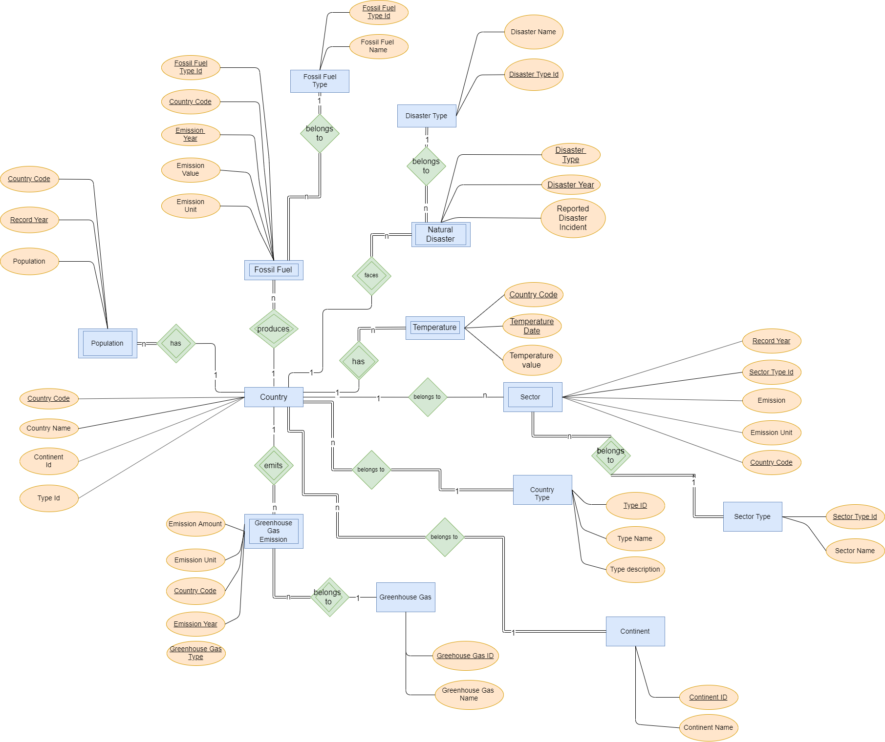

### climate-change-analysis
#### Motivation
“The Paris Agreement” was signed by 196 countries under United Nations Framework Convention on climate change. In recent times, the agreement and its associated topics has been discussed several times among the world's largest economies. As we all know, climate change is a global phenomenon and its impacts are not limited to a single country. Also, it has been recently highlighted in various news reports that climate change is already costing billions of dollars per year. We wish to dig deeper into the subject and analyze what’s driving these changes over the years.
#### Purpose of the project
The purpose of the project was to extract trends from SQL database by running complex sql queries
#### Trends Analyzed 
Below are the trends we would analyze for understanding some statistics about climate change
1) Average temperature across continents
2) Top 3 greenhouse gas emitters analysis
3) Sector wise CO2 emission analysis
4) Fuel consumption efficiency trend

Below is the image of the UI of the application and a sample trend.

#### Dataset

Following are the datasets from where we collected the data to analyze the trends mentioned in the above section.
1) Temperature data per year per country. https://www.kaggle.com/berkeleyearth/climate-change-earth-surface-temperature-data/download
2) CO2 emission per year per country. https://data.worldbank.org/indicator/en.atm.co2e.pc
3) Coal Production per year per country in terawatts-hours. https://drive.google.com/open?id=1PbEgYtZu0SMLaWxcp4mN4Q_MG5gAmGJT
4) Fossil fuel energy consumption per year per country.  https://data.worldbank.org/indicator/EG.USE.COMM.FO.ZS
5) Natural disasters(focusing mainly on floods and droughts) per country per year. https://ourworldindata.org/natural-disasters

#### ER Diagram 

#### Steps to run application
1) Make sure JAVA_HOME is correctly setup. We would need JAVA 8 for this project.
2) Make sure maven is setup on your system.
3) Open file "application.properties" and set the correct values of "username" and "password" tokens.
4) Try doing "mvn clean install", if the build is successful, then skip to step 8.
5) Download "ojdbc8.jar" from https://www.oracle.com/database/technologies/jdbc-ucp-122-downloads.html
6) Run "mvn install:install-file -Dfile=path/to/your/ojdbc8.jar -DgroupId=com.oracle -DartifactId=ojdbc8 -Dversion=19.3 -Dpackaging=jar"
7) Run "mvn clean install"
8) Run the command "java -jar target\climate-change-0.1.0.jar"
9) Open "http://localhost:8085/about"